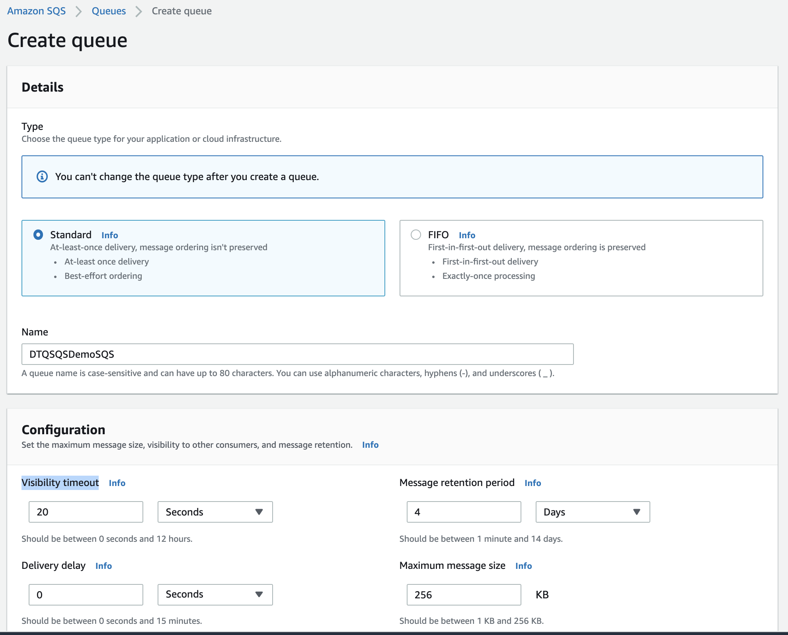
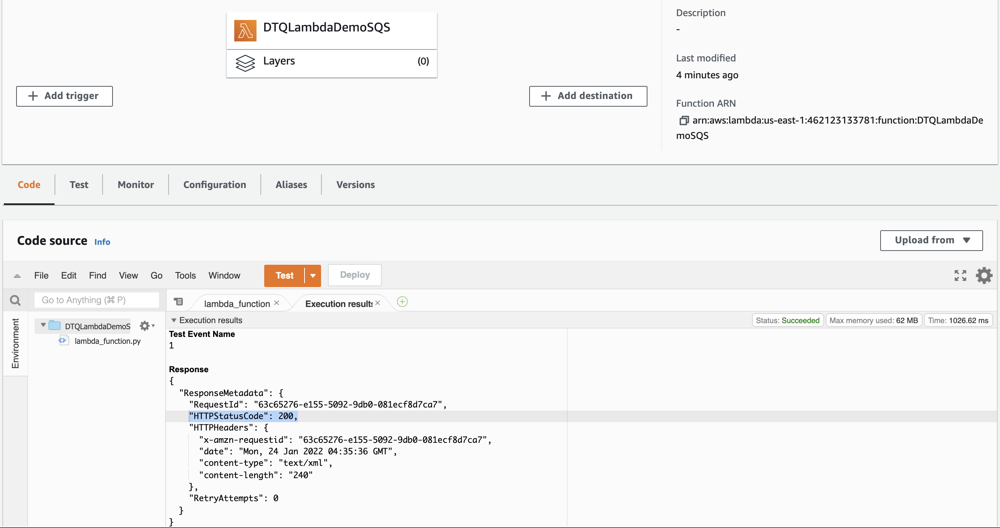
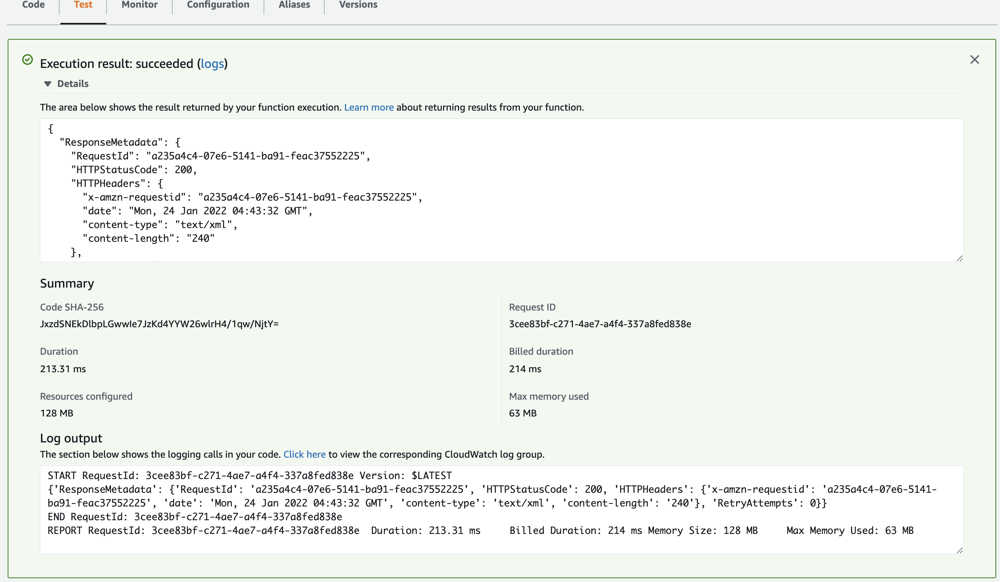
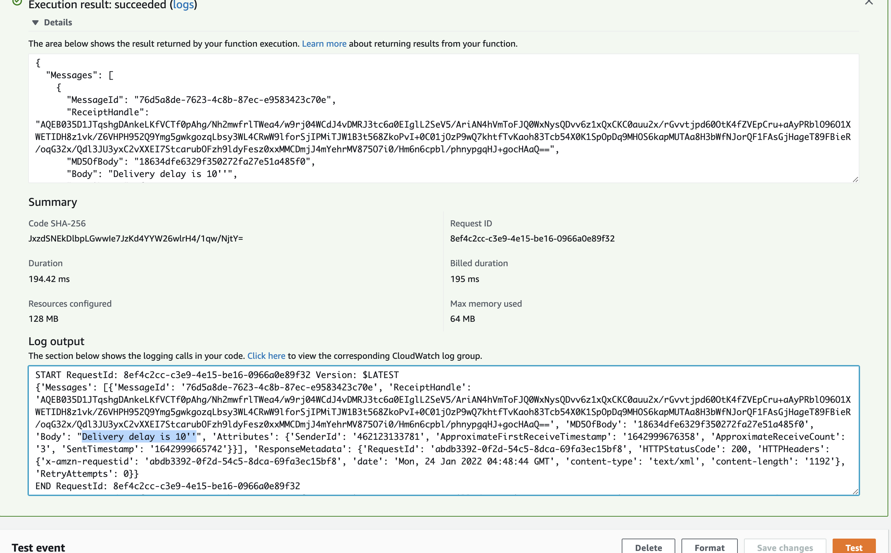

# aws-sqs-visibility-timeout-demo 🐳

## reference
[haitrungnet](https://haitrung.net/hieu-dung-ve-khai-niem-visibility-timeout-delay-queue-trong-amazon-sqs/)

## IAM role
- create role name=`DTQRoleDemoSQS`
- with policy name=`SQSFullAccess`

## SQS
- create SQS name=`DTQSQSDemoSQS`
- Visibility timeout = 20''
- Delivery delay = 0

## Lambda
- create lambda name=`DTQLambdaDemoSQS`
- with role name=`DTQRoleDemoSQS`
- run test -> check OK!

## test SQS visibility timeout
### A) Visibility timeout = 20''
- SQS > click `Send and receive messages`
- Message body=`Visibility timeout = 20''`
- Lambda > click `Test` → just show MSG in 20'' & NOT show after 20''
- show

---
- NOT show

### B) Delivery delay=10''
- SQS > setting `Delivery delay=10''` > click `Send and receive messages`
- Message body=`Delivery delay is 10''`
- Lambda > click `Test` → opposite with Visibility, just show MSG after 10''
